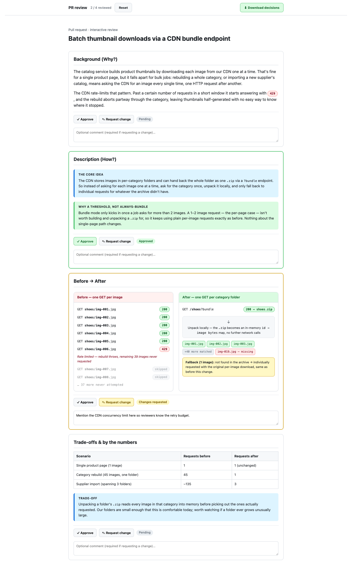
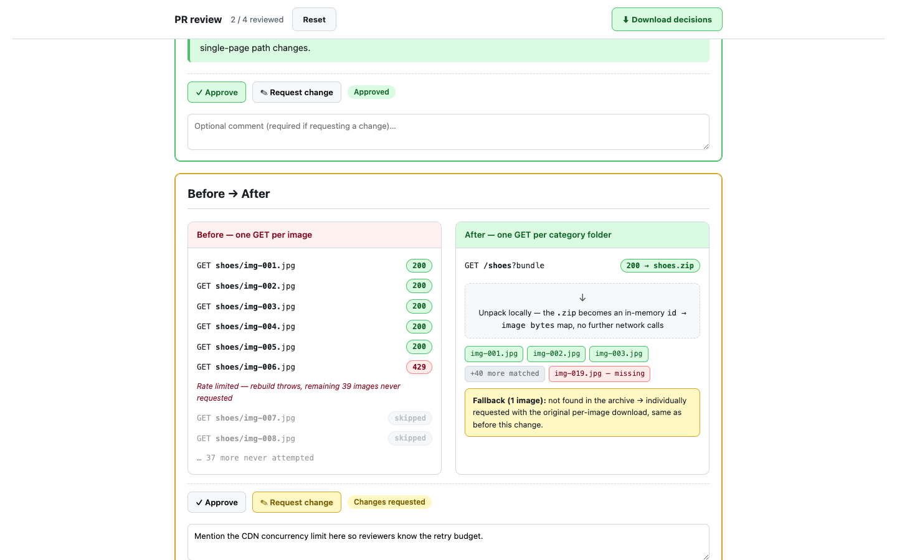

# PR Narrative

[](https://github.com/vercel-labs/skills)

Review pull requests as a story, not a wall of code.

PR Narrative is a translator between the person who wrote the code and everyone else
who needs to understand the change: reviewers, QA, and teammates who are new to the
codebase. It puts the human explanation first and the technical explanation last, in
that order.

It adds a human review layer between coding agents and GitHub, on both sides of a
pull request:

- **Reviewer mode:** review a real diff in an interactive browser UI, accept or reject AI findings, and create one pending GitHub review
- **Author mode:** turn your branch diff into a reviewer-friendly PR description

```bash
npx skills add hamedghaderi/pr-narrative
```

### 22-second demo: a cold diff becomes an annotated review

https://github.com/user-attachments/assets/2f2cb4b7-e87d-43bc-830b-5129ebfa8110

## Why not just ask an agent to review the PR?

You can, and it will find real things. The gap isn't analysis quality, it's what
happens to the findings afterwards. Ask an agent to review a PR and you get prose in a
terminal: not attached to any line, invisible to your teammates, and changing nothing on
the PR itself.

| | Plain agent prompt | Reviewer mode |
|---|---|---|
| Where findings land | Terminal scrollback | A pending review on the PR, anchored to real diff lines |
| How many you get | Unbounded | Hard cap: 3 per file, 10 per review |
| What it comments on | Depends on the prompt and model | Four categories only: probable bugs, security, missing error handling, breaking-change risk |
| How findings are triaged | Manually interpreted and copied from chat or terminal output | Each finding is visibly accepted or rejected before submission |
| Who signs the review | Ambiguous | You do. The skill never sets Approve, Request changes, or Comment |

The cap is the constraint that matters most. An unconstrained agent has no reason to
stop at three findings in a file, so it writes eleven, and the two that mattered get
buried under nine that didn't. Seeding zero findings is an explicitly valid outcome:
when nothing in the diff clears the bar, the page opens with no AI comments at all.

## How it works

### Reviewer mode

PR URL or local branch → narrative context → interactive diff → accept or reject AI
findings → **pending GitHub review**, or a local fix-list. With `python3`, the live
review server also supports in-page Q&A: the reviewer can ask follow-up questions
and request background on AI callouts while the review is open.

Those questions can be spoken instead of typed. A mic button in the Ask box dictates
into the question field, and every answer carries a read-aloud button, so you can
review a diff with your hands on the code. Whatever is playing stops from that same
button, from a pill that stays in the corner however far you scroll, or with `Escape`.
Speech input needs Chrome, Edge or Safari;
Firefox doesn't ship it, and the mic button simply doesn't appear there. Some
Chromium-based browsers, Brave among them, do show the button but have no speech
service behind it, so dictation reports that recognition is unavailable and you type
instead. Read-aloud picks the best voice the browser exposes, which on macOS means
installing an Enhanced or Premium voice under Accessibility if the default sounds
robotic. One caveat
before you dictate anything about proprietary code: a browser's speech recognition may
send the microphone audio to the vendor's own speech service to transcribe it, Chrome's
does, while typing keeps the whole exchange local.

The page puts the narrative up top and the real diff below it. Click a line to comment,
drag across a few lines for a range, or leave a suggestion. AI-drafted callouts arrive
unaccepted, so nothing reaches GitHub that you didn't keep. On Submit, your accepted
comments post as a single pending review that you finalize yourself on github.com.
Reviewing a local branch posts nothing anywhere.

### Author mode

Branch diff → narrative PR body → section-by-section approval → revision loop →
**final Markdown**

It writes the description from the code rather than the ticket, and structures it so
a reader can understand the change without opening the diff. A one-sentence summary
comes first, then the problem story, a concrete example, what QA should test, what the
change deliberately leaves untouched, and technical details last. You Approve or
Request-change each section, your decisions go back through a small bundled local
server, and it revises until everything is approved. The body fills your repo's PR
template and stands on its own.

Both modes avoid mermaid diagrams, file-by-file changelogs and method-name dumps, and
Author mode never opens the PR for you.

## Example output

Both artifacts below come from one invented scenario: a service that fetched product
thumbnails one at a time and hit a CDN rate limit, and now pulls a whole category as a
single bundle.



*The before panel shows one-request-per-image calls hitting a red `429` and stalling the
rest of the batch; the after panel shows the single `?bundle` request unpacking into
file chips instead.*



*Two adjacent sections, two independent verdicts: one approved, one with changes
requested. Each section carries its own state until every one is approved.*

The Markdown body that ships alongside the page makes the same change concrete:

| | Before | After |
|---|---|---|
| Requests to the CDN | 45 (one per image) | 1 bundle plus rare fallbacks |
| Where it fails | Aborts on the ~6th request (`429`) | Completes; only genuinely missing images fall back |
| Images actually built | 5 of 45 | 45 of 45 |

The full generated pair, the [Markdown body](./examples/pr-body-thumbnails.md) and its
[HTML visual](./examples/pr-thumbnails.html), lives in [`examples/`](./examples).

## Works with

PR Narrative uses the open `SKILL.md` format and installs through the
[`skills` CLI](https://github.com/vercel-labs/skills) for **Claude Code**, **OpenCode**,
**Cursor**, **Codex** and
[other supported agents](https://github.com/vercel-labs/skills#supported-agents).

Running it needs an agent that can execute shell commands and open a browser. The live
review server is optional, but using it also means the agent has to hold a background
process open.

## Installation

```bash
npx skills add hamedghaderi/pr-narrative
```

The CLI clones the repo, finds the `pr-narrative` skill, detects your agent, and
installs it to the right directory. For flags like `--list`, `-g` and `--copy`, see the
[`skills` CLI docs](https://github.com/vercel-labs/skills).

<details>
<summary><strong>Requirements by mode</strong></summary>

| Requirement | Reviewer mode | Author mode |
|---|---|---|
| An agent with shell access | Required. Backgrounding a process is required for the standard live server with Q&A; not needed for the fallback path or subcommands | Required, same |
| `git` and a browser | Required | Required |
| `gh`, authenticated | Only to review a real PR; reviewing a local branch needs none | Never used. Reads your local git history only |
| `python3` | Required for the standard live server and in-page Q&A. Without it the page falls back to a download button and the Ask UI is absent, though annotations still work via download. | Optional, identical fallback |

The `explain` and `summarize-changes` subcommands are lighter: they touch `gh` in a
read-only way only when you hand them a PR URL, need no `gh` at all for a local branch,
and never need `python3`, since neither one starts a server.

</details>

<details>
<summary><strong>Manual install (clone and copy)</strong></summary>

```bash
git clone https://github.com/hamedghaderi/pr-narrative.git

# OpenCode / .agents-style skills:
mkdir -p ~/.agents/skills/pr-narrative
cp -R pr-narrative/SKILL.md pr-narrative/references ~/.agents/skills/pr-narrative/

# Claude Code / .claude-style skills:
mkdir -p ~/.claude/skills/pr-narrative
cp -R pr-narrative/SKILL.md pr-narrative/references ~/.claude/skills/pr-narrative/
```

Only `SKILL.md` and `references/` are needed; `examples/` is just for reference.

</details>

## Usage

The skill triggers on either intent, and confirms which one with a single question
before it starts rather than guessing.

**To review:** "review this PR <url>", "review PR #42", "review my branch before I open
a PR".

**To write a description:** "write the PR for this branch", "make a PR description for
these changes", "describe this change for review".

### Direct subcommands

Three subcommands, `explain`, `review-security` and `summarize-changes`, go straight to
the work: naming one skips the mode question.

**`/pr-narrative explain <pr-url | #N | branch>`** explains the change as a story, in
chat. No browser page.

**`/pr-narrative review-security <pr-url | #N | branch>`** is reviewer mode with AI findings
narrowed to security only, under the same caps: 3 per file, 10 per review.

**`/pr-narrative summarize-changes [pr-url | #N | branch]`** gives a quick summary of
what changed and why it matters.

> ⭐ If this improves your review workflow, star the repository so other developers can
> find it.

## License

[MIT](./LICENSE)
